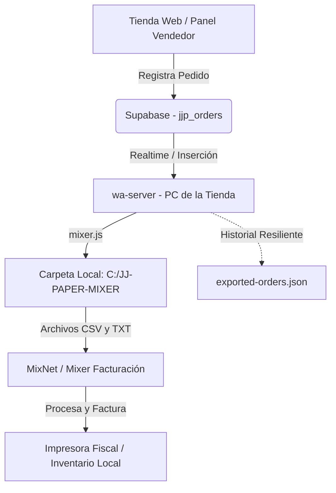

# Guía de Conexión y Configuración: Servidor Local ⇄ MixNet / Mixer

Esta guía detalla paso a paso cómo se realiza la conexión entre el servidor local de la tienda (`wa-server`) y el facturador local **MixNet / Mixer** para la gestión y facturación de pedidos de **JJ Paper**.

---

## 🗺️ Diagrama del Flujo de Datos



---

## 🛠️ Paso 1: Configurar el Servidor Local (`wa-server`)

El servidor local actúa como un puente ("mixer.js") que extrae los pedidos desde la nube (Supabase) y los deposita en la PC local.

### 1. Verificar la carpeta de exportación
Abre el archivo de configuración de entorno del servidor local ubicado en:
* `wa-server/.env`

Asegúrate de que la variable `MIXER_EXPORT_DIR` apunta a la ruta física deseada en la PC. Por defecto viene configurada así:
```ini
MIXER_EXPORT_DIR=C:/JJ-PAPER-MIXER
```
> [!NOTE]
> Puedes cambiar esta ruta a cualquier directorio que prefieras (por ejemplo, a una carpeta interna del facturador MixNet). El servidor creará la carpeta automáticamente si no existe.

### 2. Encender o Reiniciar el Servidor
Para aplicar los cambios y activar el puente, debes arrancar el servidor en la PC física de la tienda:
1. Entra a la carpeta `wa-server`.
2. Haz doble clic en el archivo `START-SERVIDOR.bat` (o usa la consola y ejecuta `npm start`).
3. En la ventana negra de comandos, deberás ver los siguientes mensajes que confirman que el puente está activo:
   ```text
   Puente Mixer: Iniciando. Carpeta de exportación: C:/JJ-PAPER-MIXER
   Puente Mixer: Cargadas X órdenes en el historial de exportación.
   Puente Mixer: Iniciando listener Realtime de pedidos...
   Puente Mixer: Estado del canal Realtime: joined
   ```

> [!TIP]
> Puedes comprobar si el servidor está activo desde el panel web de administración de JJ Paper. Busca el indicador de estado del servidor en la cabecera (debe marcar 🟢 **En línea** y mostrar un latido menor a 70 segundos).

---

## 📥 Paso 2: Configurar el Software de Facturación (MixNet / Mixer)

Para recibir los pedidos del sistema en tu facturador local, debes configurar el importador del software de facturación MixNet.

### Opción A: Importación mediante Archivos Planos (Recomendado)
El software de facturación debe vigilar la carpeta configurada en `MIXER_EXPORT_DIR` (ej. `C:\JJ-PAPER-MIXER`). Cuando ingrese un pedido, el servidor generará dos archivos:

#### 1. Archivo CSV (`pedido_[Número].csv`)
Diseñado para que tu sistema de facturación lo procese de forma automatizada. 

* **Formato de columnas (Separado por comas `,`):**
  `Pedido, Fecha, Cliente, RIF, Telefono, SKU, Producto, Marca, Cantidad, PrecioUnitario, SubtotalLinea, TotalPedidoUSD, TasaCambio, TotalPedidoBs`
  
* **Ejemplo de contenido:**
  ```csv
  Pedido,Fecha,Cliente,RIF,Telefono,SKU,Producto,Marca,Cantidad,PrecioUnitario,SubtotalLinea,TotalPedidoUSD,TasaCambio,TotalPedidoBs
  10542,2026-08-06T18:30:00Z,"Juan Perez","V-12345678","04141234567","SKU-LIB-01","Libreta Escolar A4","Caribe",5,2.50,12.50,12.50,45.50,568.75
  ```

#### 2. Archivo TXT (`pedido_[Número].txt`)
Un formato pre-diseñado y amigable para lectura humana o para ser impreso directamente en una ticketera / comandera de 48 caracteres.

* **Ejemplo de contenido:**
  ```text
  ================================================
  PEDIDO: 10542
  Fecha: 6/8/2026 14:30:00
  Cliente: Juan Perez
  RIF/CI: V-12345678
  Teléfono: 04141234567
  ================================================
  Detalle:
  Cant.   Producto [Marca]            P.Unit   Subtotal
  ------------------------------------------------
     5 x Libreta Escolar A4 [Caribe]    2.50     12.50
  ------------------------------------------------
  TOTAL USD: $12.50
  Tasa de cambio: 45.50 Bs/$
  TOTAL BS:  568.75 Bs
  ================================================
  ```

> [!IMPORTANT]
> **Resiliencia ante duplicados:** El Mixer de facturación usualmente "jale" (procese) e inmediatamente **elimine** los archivos CSV/TXT de la carpeta `C:\JJ-PAPER-MIXER`. Para evitar que el servidor los vuelva a generar por error al reiniciar o actualizar un pedido, el servidor guarda el historial de pedidos exportados en `wa-server/exported-orders.json`. Este archivo **no debe ser borrado**.

---

### Opción B: Consumo de API HTTP Local (Vía Red LAN)
Si tu software de facturación o un script local prefiere consultar un endpoint web en lugar de leer archivos del disco, el servidor local expone un endpoint dentro de la red WiFi/LAN de la tienda.

* **URL del Endpoint:**
  ```text
  http://localhost:8787/lan/mixnet/pedidos
  ```
  *(Puedes reemplazar `localhost` por la IP local del servidor de la tienda si accedes desde otra PC).*

* **Parámetros disponibles:**
  * `format`: Especifica el formato de salida. Puede ser `json` (por defecto) o `csv`.
  * `days`: Cantidad de días de historial a recuperar (por defecto `3` días). Ej: `?days=5`

* **Ejemplo en formato CSV consolidado (`/lan/mixnet/pedidos?format=csv`):**
  Este endpoint consolida todos los pedidos recientes en un único archivo.
  * **Estructura del CSV Consolidado:**
    `Pedido,Fecha,Cliente,RIF,Telefono,Ciudad,MetodoPago,Referencia,SKU,Producto,Cantidad,PrecioUSD,SubtotalUSD,Tasa,TotalUSD,TotalBs`

---

## 🔍 Paso 3: Validación y Pruebas

Para garantizar que la integración funcione perfectamente de punta a punta:

1. **Prueba de Escritura Inicial:**
   Al iniciar `wa-server`, este realizará un barrido automático de los pedidos de las últimas 48 horas. Revisa la carpeta `C:\JJ-PAPER-MIXER` y valida que se hayan escrito correctamente los archivos `.csv` y `.txt` de los pedidos recientes.
2. **Prueba de Tiempo Real:**
   Crea un pedido de prueba desde el POS o Cotizador. En la ventana del servidor local de comandos deberás ver de inmediato el mensaje:
   ```text
   Puente Mixer: Recibida inserción de pedido XXX por Realtime.
   Puente Mixer: Pedido XXX exportado correctamente.
   ```
   Valida que los archivos de este nuevo pedido aparezcan instantáneamente en la carpeta local.
3. **¿Qué hacer si necesito volver a exportar un pedido?**
   Si por alguna razón el Mixer de facturación no procesó una orden y necesitas que el servidor vuelva a generar el archivo CSV/TXT:
   1. Abre el archivo `wa-server/exported-orders.json`.
   2. Busca el número del pedido en la lista.
   3. Elimina ese número de pedido del archivo JSON y guarda los cambios.
   4. En 30 segundos, el barrido automático del servidor detectará que falta en el historial y volverá a generar los archivos en la carpeta de exportación.
