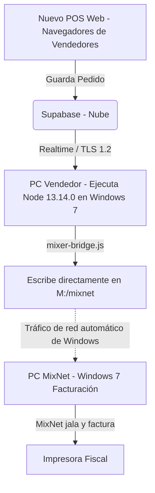

# Solución de Red y Conexión para MixNet / Mixer (Unidad de Red M:)

Dado que las computadoras de los vendedores ya cuentan con una **Unidad de Red mapeada (Unidad M:)** que conecta directamente con la PC de facturación de MixNet (bajo la carpeta `M:\mixnet`), podemos simplificar la arquitectura al máximo.

No es necesario configurar permisos de red compartida, cortafuegos o grupos de trabajo en Windows 7. Aprovecharemos esta conexión existente de la siguiente manera:

El puente autónomo (`mixer-bridge.js`) se ejecutará en **una de las PC de los vendedores** utilizando **Node.js 13.14.0** (compatible con Windows 7). Este script leerá en tiempo real los pedidos de la nube (Supabase) y escribirá los archivos directamente en la unidad virtual `M:\mixnet`. El propio sistema operativo Windows 7 se encargará de transferir los archivos de forma invisible hacia la PC de facturación.

---

## 🗺️ Diagrama de la Arquitectura con Unidad M:



---

## 📋 Configuración de Entorno (.env) en la PC del Vendedor

En la PC del vendedor que ejecutará el puente, el archivo `.env` se configura directamente apuntando a la unidad mapeada:

```ini
SUPABASE_URL=https://oeiuczltgdexwjjgquyq.supabase.co
SUPABASE_SERVICE_ROLE_KEY=PEGA_AQUI_LA_SERVICE_ROLE_KEY
MIXER_EXPORT_DIR=M:/mixnet
```
*(Si los pedidos deben dejarse directamente en la raíz de la unidad M:, cambia la variable a `MIXER_EXPORT_DIR=M:/`).*

---

## 🚀 Paso a Paso: Implementación

### 🖥️ Parte A: Preparación
1. En la PC del Vendedor elegida, comprueba en el Explorador de Archivos que la unidad **M:** esté activa y que puedas crear un archivo de texto de prueba dentro de la carpeta `mixnet` (para verificar permisos de escritura).

### 💻 Parte B: Configuración en la PC del Vendedor
1. **Instalar Node.js 13.14.0**:
   - Descarga directa para 64 bits: [node-v13.14.0-x64.msi](https://nodejs.org/dist/v13.14.0/node-v13.14.0-x64.msi)
   - Descarga directa para 32 bits: [node-v13.14.0-x86.msi](https://nodejs.org/dist/v13.14.0/node-v13.14.0-x86.msi)
2. Crea la carpeta `C:\JJ-PAPER-BRIDGE` en el disco local y copia allí el archivo [`mixer-bridge.js`](file:///C:/Users/PC/Desktop/JJ%20PAPER/mixer-bridge.js).
3. Crea el archivo `.env` con las credenciales de Supabase y el valor `MIXER_EXPORT_DIR=M:/mixnet`.
4. Abre la consola (`cmd`), navega a la carpeta y ejecuta:
   ```bash
   cd C:\JJ-PAPER-BRIDGE
   npm init -y
   npm install @supabase/supabase-js dotenv pino pino-pretty
   ```
5. Prueba el puente ejecutando: `node mixer-bridge.js`
6. Valida que los pedidos aparezcan en la unidad `M:\mixnet`.
7. Crea el archivo `START-PUENTE.bat` y arrastra su acceso directo a la carpeta **Inicio** (Startup) de Windows 7 en esa PC de vendedor para que corra siempre en segundo plano al encender el equipo.
